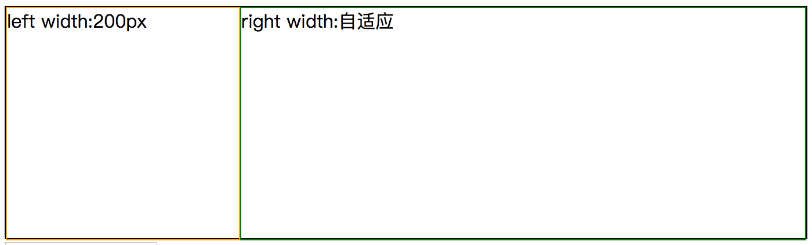
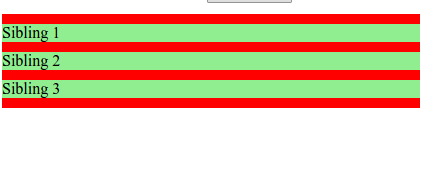
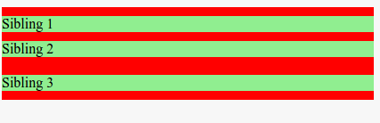

# 前端知识点总结

内容持续更新中...

# 目录

## 1. JavaScript基础
   1. [DOM（文档对象模型）](http://caibaojian.com/javascript-lessons/2.2-DOM/?q=)
   2. [JavaScript 基本数据类型和引用数据类型](https://segmentfault.com/a/1190000006752076)
   3. [JS数据类型判断](https://zhuanlan.zhihu.com/p/129642585)
   4. [事件冒泡和事件捕获](https://zh.javascript.info/bubbling-and-capturing)
   5. [js中的事件委托或事件代理详解](https://juejin.im/post/6844903589052153869)
   6.  [DOM 事件模型](https://juejin.im/post/6844903850323755021)
   7.  [JS函数防抖和函数节流](https://juejin.im/post/6844903535125987335)
   8.  [JavaScript 设计模式](https://juejin.im/post/6844904032826294286#heading-61)
   9.  [跨域解决方案](https://juejin.im/post/6844903767226351623)
   10. [页面间通信与数据共享](https://juejin.im/post/6844903681595277320)
   11. [JSON 相关知识点](https://www.sojson.com/json/json_what.html)
   12. [数组和对象的区别与联系](https://www.jianshu.com/p/08e2e7da6d2d)
   13. [JS中异常捕获](https://blog.cuiyongjian.com/fe/catch-error/)
   14. [arguments对象详解](https://zhuanlan.zhihu.com/p/23007032)
   15. [ Cookie, LocalStorage 与 SessionStorage](https://jerryzou.com/posts/cookie-and-web-storage/)
  
## 2. JavaScript 进阶
   1. [JavaScript深入之词法作用域和动态作用域](https://github.com/mqyqingfeng/Blog/issues/3)
   2. [JavaScript深入之执行上下文栈 ](https://github.com/mqyqingfeng/Blog/issues/4)
   3. [JavaScript作用域链 ](./JavaScript基础/JavaScript%20作用域和作用域链.md)
   4. [JavaScript闭包](./JavaScript基础/闭包.md)
   5. [JavaScript基础——this](https://github.com/axuebin/articles/issues/6)
   6. [JavaScript基础心法——call apply bind ](https://github.com/axuebin/articles/issues/7)
   7. [JavaScript深入之bind的模拟实现 ](https://github.com/mqyqingfeng/Blog/issues/12)
   8. [JavaScript深入之new的模拟实现](https://github.com/mqyqingfeng/Blog/issues/13)
   9. [Javascript原型链及原型链继承](./JavaScript基础/Javascript原型链及原型链继承.md)
   10. [JavaScript 中的继承：ES3、ES5 和 ES6](https://juejin.im/post/6844903543476846600)
   11. [JavaScript Promise](./JavaScript基础/Promise.md)
   12. [从event loop规范探究javaScript异步及浏览器更新渲染时机](https://github.com/aooy/blog/issues/5)
   13. [JavaScript 深浅拷贝](https://github.com/axuebin/articles/issues/20)
   14. [JavaScript 函数式编程](https://github.com/zhaiyy/blog/blob/master/article/Javascript%20%E5%87%BD%E6%95%B0%E5%BC%8F%E7%BC%96%E7%A8%8B.md)
   15. [PWA - Service Worker](https://github.com/zhaiyy/blog/blob/master/article/%EF%BC%88PWA%EF%BC%89-%20Service%20Worker%20copy.md)


----------------------------------
* [html知识点](#html知识点)
* [css知识点](#css知识点)
* [html5 ](#html5)
* [css3](#css3)
* [jquert](#jquery)
* [ES6知识点](#ES6知识点)
* [js 深入理解题](#js深入理解题)
* [vue](#vue)
* [npm](#npm)
* [gulp && webpack](#gulp)
* [计算机网络](#计算机网络)
* [算法程序](#算法程序)
* [前端性能优化](#前端性能优化)

## html知识点

**索引**

1. [为什么要进行标签语义化](#为什么要进行标签语义化)
2. [什么是行内元素，块级元素及区别](#html-2)
3. [常用的行内元素和块级元素](#常用的行内元素和块级元素)
----------------------------------

### 为什么要进行标签语义化
语义化的网页的好处：
* 对搜索引擎友好，有了良好的结构和语义你的网页内容自然容易被搜索引擎抓取，这种符合搜索引擎收索规则的做法，网站的推广便可以省下不少的功夫
* 而且可维护性更高
* 结构清晰，十分易于阅读。
* 方便布局

### <h3 id='html-2'>什么是行内元素，块级元素及区别</h3>
行内元素和块级元素的区别：
* 行内元素会再一条直线上，是在同一行的。行内元素不可以控制宽和高，它的宽和高，是随标签里的内容而变化。如果你要将行内元素变成块级元素，那么就只需要在该标签上加上样式 display:block;
* 块级元素各占一行。是垂直方向的！如果你要将行内元素变成块级元素，那么就只需要在该标签上加上样式 display:inline-block;

### 常用的行内元素和块级元素
* 行内元素 span img b select input
* 块级元素 div a ul li h1 h2 h3 hr


## css知识点

**索引**

1. [css 选择器](#css选择器)
2. [如何让几个div水平排列](#如何让几个div水平排列)
3. [怎么清除浮动](#怎么清除浮动)
4. [浮动的原理](#浮动的原理)
5. [css垂直居中方法](#css垂直居中方法)
6. [实现布局左侧固定尺寸,右侧自适应](#css-6)
7. [css flex 使用](#css-7)
8. [css 实现左右两列等高容器布局](#css-8)
9. [css 实现三角形](#css-9)
----------------------------------

### css选择器
* 元素选择器
```
html {color:black;}
h1 {color:blue;}
h2 {color:silver;}
```
* id选择器
```
#intro {color:black;}
```
* 类选择器
```
.important {color:black;}
```
* 属性选择器

```
a[href] {color:red;}
```
* 后代选择器
```
h1 em {color:red;}s
```
* 子元素选择器
```
h1>em {color:red;}
```
* 相邻兄弟选择器
```
h1+em {color:red;}
```
* 伪类选择器


### 如何让几个div水平排列

* css float
* css display:inline
* css flex ( [flex使用](https://www.talkingcoder.com/article/6424383824800383038))

### 怎么清除浮动

* 给父级元素添加 clear:both
* 给父级元素添加 overflow:auto;zoom=1
* 给父级元素添加 overflow:hidden
* 给浮动元素的临界元素，即下一个兄弟元素，添加<div style=“clear:both”\>

### 浮动的原理
使的当前元素脱离文档流存在，也就是像浮云一样漂浮在普通流之上


### css垂直居中方法

* 使用 Line-Height 垂直居中图片

```
<div id="parent">
    
</div>

#parent {
    line-height: 200px;
}

#parent img {
    vertical-align: middle;
}
```
* CSS表格法


```
<div id="parent">
    <div id="child">Text here</div>
</div>

#parent {
    display: table;
}

#child {
    display: table-cell;
    vertical-align: middle;
}
```

* 绝对定位和负边距法

```
<div id="parent">
    <div id="child">Content here</div>
</div>

#parent {
    position: relative
}

#child {
    position: absolute;
    top: 50%;
    left: 50%;
    height: 30%;
    width: 50%;
    margin: -15% 0 0 -25%;
}
```

这种方法利用绝对定位先将元素的上边界和左边界移动到50%的位置，再根据元素的尺寸调整负边距以达到居中的效果。

* 上下内边距（padding）相等法

 这种方法通过设置上下padding相等来实现垂直居中。

```
<div id="parent">
    <div id="child">Content here</div>
</div>

#parent {
    padding: 5% 0;
}

#child {
    padding: 10% 0;
}
```

  上面的代码使用了相对尺寸，然而如果需要指定元素尺寸时，就需要使用绝对尺寸并做一个简单的计算了。例如，如果指定父元素高度为400px，子元素高度为100px，要实现垂直居中需要设置父元素的上下padding为150px。

### <h3 id='css-6'>实现布局左侧固定尺寸,右侧自适应</h3>


**html**

```
<div class=container>
<div class='left'>left width:200px</div>
<div class='right'>right width:自适应</div>
</div>
```
* 使用flex 布局

```
.container{
    display:flex;
    width: 100%;
    height:200px;
    border: 1px solid #000;
}
.left{
    width: 200px;
    height: 200px;
    border: 1px solid orange;
}
.right{
    flex: 1;
    width: 100%;
    height: 200px;
    border: 1px solid green;
}
```
* 相对定位

```
.container {
  position: relative;
  width: 100% ;
  height: 200px;
  border: 1px solid #000;
}
.left{
    position:absolute ;
    top: 0;
    left: 0;
    width: 200px;
    height: 200px;
    border: 1px solid orange;
}
.right{
    position: absolute;
    top: 0;
    left: 200px;
    width: 100%;
    height: 200px;
    border: 1px solid green;
}
```
* 浮动布局

```
.container {
  width: 100% ;
  height: 200px;
  border: 1px solid #000;
  clear: both;
}
.left{
    float: left;
    width: 200px;
    height: 200px;
    border: 1px solid orange;
}
.right{
    width: auto;
    height: 200px;
    padding-left: 200px;
}
```

### <h3 id='css-7'>css flex 使用</h3>

flex属性指定项目的长度，相对于同一容器内的其余项目。
Flex 是 Flexible Box 的缩写，意为"弹性布局"，用来为盒状模型提供最大的灵活性。

任何一个容器都可以指定为 Flex 布局。

 ```
 .box{
   display: flex;
 }
 ```

** 设为 Flex 布局以后，子元素的`float`、`clear`和`vertical-align`属性将失效。 **

例：
```
.container {
  display: flex;
  display: -webkit - flex;
  border: 4 px solid\ #000;
}

.initial {
 flex: inherit;
 -webkit-flex: inherit;
 width: 200px;
 min-width: 100px;
 border: 2px solid red;
}

.none {
 flex: none;
 width: 200px;
 border: 2px solid blue;

}
.flex1 {
  flex: 1;
  border: 2 px solid green;
}
.flex2 {
  flex: 2;
  border: 2 px solid orange;
}
```


### <h3 id='css-8'>css 实现左右两列等高容器布局，要求元素实际占用的高度以两列中较高的为准</h3>

```
// html

<div class="container">
    <div class="left"></div>
    <div class="right"></div>
</div>

```
* flex 布局方式

```
.container{
       display: flex;
        width: 100px;
    }
    .left,.right{
       flex: 1;
    }
```

* table 布局

```
 .container{
        display: table;
        width: 100px;
        table-layout: fixed;
    }
    .left,.right{
        display: table-cell;
    }
```

* grid 布局

```
.container{
        display: grid;
        grid-auto-flow: column;
        grid-gap:20px;
        width: 100px;
    }
```

### <h3 id='css-9'>css 实现三角形</h3>

// 下三角
```
<div class="container"></div>
.container{
        width: 0;
        height: 0;
        border: 50px solid transparent;
        border-bottom: 50px solid red;
}

```
transparent: 不过如果您不希望某元素拥有背景色，同时又不希望用户对浏览器的颜色设置影响到您的设计，那么设置transparent

## html5

**索引**

1. [html5新增的属性](#html5新增的属性)
2. [app与html5的优缺点](#app与html5的优缺点)
3. [hyBird模式](#hyBird模式)
4. [移动端自适应](#移动端自适应)
5. [Viewport](#Viewport)
6. [rem](#rem)
7. [em](#em)
----------------------------------

### html5新增的属性

* 新增了一些标签 header footer nav section aside 可以更好的描述文本结构
* 新增了音视频标签 video audio
* canvas
* 新增了一些标签属性 input type = number, email,color,date,datetime,month,range,tel,url


### app与html5的优缺点

* app又叫做原生态应用开发，开发出的产品更加流畅稳定、app开发可以操作手机，可以将部分数据缓存到手机上
* 可以调取本地的图库，调取通讯录，打开摄像头，指南针，陀螺仪，重力感应，从操作起来还是比较方便的
* 缺点：需要打包上传到应用市场时效性需要用户自主手动更新才能更新

### hyBird模式

* h5页面嵌入到第三方平台，微信，qq、微博

* 微信的第三方接口在别人的地盘活动，需要了解的细节规则

### 移动端自适应

1、设计师给的一般是640px的效果图，我们按照640px进行切图

2、布局的时候，我们宽度一般不设定宽度，上宽度随着屏幕大小的改变自适应

3、对于文字 、晓得icon、缩略图等小图、高度、margin、padding一般情况下给固定的值，原有的640px效果图下的一半

4、媒体查询，其实就是把small.css文件中的样式放在了@media srceen and (max-width;600px){...}的大括号之中。在语句上面的语句结构中，可以看出Media query和css的属性集合很相似，主要区别在：

  * Media query只接受单个的逻辑表达式作为其值，或者没有值；
  * css属性用于声明如何表现页页的信息；而Media Query是一个用于判断输出设备是否满足某种条件的表达式；
  * Media Query其中的大部分接受min/max前缀，用来表示其逻辑关系，表示应用于大于等于或者小于等于某个值的情况
  * CSS属性要求必须有属性值，Media Query可以没有值，因为其表达式返回的只有真或假两种

### Viewport
viewport 是用户网页的可视区域,翻译为中文可以叫做"视区"。
在具体一点，就是浏览器上(也可能是一个app中的webview)用来显示网页的那部分区域，但viewport又不局限于浏览器可视区域的大小，它可能比浏览器的可视区域要大，也可能比浏览器的可视区域要小。在默认情况下，一般来讲，移动设备上的viewport都是要大于浏览器可视区域的，这是因为考虑到移动设备的分辨率相对于桌面电脑来说都比较小，所以为了能在移动设备上正常显示那些传统的为桌面浏览器设计的网站，移动设备上的浏览器都会把自己默认的viewport设为980px或1024px（也可能是其它值，这个是由设备自己决定的），但带来的后果就是浏览器会出现横向滚动条，因为浏览器可视区域的宽度是比这个默认的viewport的宽度要小的。

利用meta标签对viewport进行控制

我们在开发移动设备的网站时，最常见的的一个动作就是把下面这个东西复制到我们的head标签中：
`<meta name="viewport" content="width=device-width, initial-scale=1.0, maximum-scale=1.0, user-scalable=0">`

在苹果的规范中，meta viewport 有6个属性(暂且把content中的那些东西称为一个个属性和值)，如下：

|mame | value |
| ------------- |:-----------------------------:|
| width | 设置layout viewport 的宽度，为一个正整数，或字符串"width-device" |
| initial-scale | 设置页面的初始缩放值，为一个数字，可以带小数 |
| minimum-scale | 允许用户的最小缩放值，为一个数字，可以带小数 |
| maximum-scale | 允许用户的最大缩放值，为一个数字，可以带小数 |
| height  | 设置layout viewport 的高度，这个属性对我们并不重要，很少使用 |
| user-scalable | 是否允许用户进行缩放，值为"no"或"yes", no 代表不允许，yes代表允许 |


### rem
rem 单位如何转换为像素值

当使用 rem 单位，他们转化为像素大小取决于页根元素的字体大小，即 html 元素的字体大小。 根元素字体大小乘以你 rem 值。

例如，根元素的字体大小 16px，10rem 将等同于 160px，即 10 x 16 = 160。

 rem 单位翻译为像素值是由 html 元素的字体大小决定的。 此字体大小会被浏览器中字体大小的设置影响，除非显式重写一个具体单位

### em
em 单位如何转换为像素值

当使用em单位时，像素值将是em值乘以使用em单位的元素的字体大小。

例如，如果一个 div 有 18px 字体大小，10em 将等同于 180px，即 10 × 18 = 180。

 em 单位转为像素值，取决于他们使用的字体大小。 此字体大小受从父元素继承过来的字体大小，除非显式重写与一个具体单位。


## css3

**索引**

1. [css3新增的属性](#css3新增的属性)
2. [css3 Animate/transition/translate 区别？](#css3-2)
3. [对CSS3中bfc的理解和应用](#css3-3)
4. [BFC在布局中的应用](#css3-4)
5. [Canvas SVG 区别](#css3-5)
----------------------------------

### css3新增的属性

* 新增了圆角 border-radius box-shadow border-image
* 阴影 text-shadow
* css 动画 transform
* animation

### <h3 id="css3-2">css3 Animate/transition/translate 区别?</h3>

1. css3中没有animate，只有animation（动画属性）。使用方法：用@keyframes定义自定义动画，用animation引用该动画。最简单的写法：
`animation：name（自定义动画名称） duration（持续时间）;`
例：
`animation：scroll 2s;`
意思是在2s内运行自定义的scroll动画。
2. transition（过渡属性）。使css属性在一段时间内平滑过渡。最简单写法：
`transition：property（需要过渡的属性） duration（持续时间）;`
例：
`transition：background-color 2s;`
意思是用2s时间过渡背景颜色。该属性比animation低级一些。不能自定义动画，只是模拟。
3. translate（位移）是transform（变换属性）的一种。最简单写法为：
`transform：translate（x）;`
例：
`transform：translate（100px）;`
意思是元素在x轴上从当前位置移动到100px

### <h3 id='css3-3'>对 CSS3 中 bfc 的理解和应用</h3>

块级格式化上下文，它是指一个独立的块级渲染区域，只有Block-level Box参与，该区域拥有一套渲染规则来约束块级盒子的布局，且与区域外部无关。

BFC是一块渲染区域，那这块渲染区域到底在哪，它又是有多大，这些由生成BFC的元素决定，CSS2.1中规定满足下列CSS声明之一的元素便会生成BFC。

* float的值不为none；
* overflow的值不为visible；
* display的值为inline-block、table-cell、table-caption；
* position的值为absolute或fixed；
看到有人把display：table也认为可以生成BFC，其实这里的主要原因在于Table会默认生成一个匿名的table-cell，正是这个匿名的table-cell生成了BFC。

### <h3 id='css3-4'>BFC 在布局中的应用</h3>
* 防止margin重叠,可以消除Margin Collapse
在正常情况下，在一个容器内的所有box将会由上至下依次垂直排列，即我们所说的一个元素占一行，并切垂直相邻的距离(即margin)是由各自的margin决定的，而不是两个margin的叠加。
让我们看一个例子：红色的div包含三个绿色的p元素。
html代码
```
<div class="container">
  <p>Sibling 1</p>
  <p>Sibling 2</p>
  <p>Sibling 3</p>
</div>
```
css代码
```
.container { background-color: red; overflow: hidden;}
p { background-color: lightgreen; margin: 10px 0;}
```
理想情况下，我们会认为p标签之间的margin应该是它们的和(20px),但实际上却是10px.这其实是collapsing margins

这似乎让人有点困惑，BFC导致了margin collapse，而现在又要用它来解决margin cllapse.但是始终要记住一点：只有当元素在同一个BFC中时，垂直方向上的margin 才会clollpase.如果它们属于不同的BFC，则不会有margin collapse.因此我们可以再建立一个BFC去阻止margin collpase的发生。
现在HTML变成：
```
<div class="container">
    <p>Sibling 1</p>
    <p>Sibling 2</p>
    <div class="newBFC">
      <p>Sibling 3</p>
    </div>
</div>
```
CSS也有改变：
```
.container { background-color: red; overflow: hidden;}
p { margin: 10px 0; background-color: lightgreen;}
.newBFC { overflow: hidden; }
```
现在的结果为：

由于第二个p元素和第三个p元素属于不同的BFC，因此避免了margin collapse.

* 浮动相关问题；
```
<div class="container">
    <div>Sibling</div>
    <div>Sibling</div>
</div>


.container { overflow: hidden; background-color: green;}
.container div { float: left; background-color: lightgreen; margin: 10px;}
```
* 多栏布局的一种方式!

### <h3 id='css3-5'>Canvas SVG 区别 </h3>

* Canvas 适用场景：

Canvas 提供的功能更原始，适合像素处理，动态渲染和大数据量绘制； Canvas 是使用 JavaScript 程序绘图，提供画布标签和绘制 API(动态生成)； Canvas 是基于位图的图像，它不能够改变大小，只能缩放显示；

* SVG 适用场景：

** SVG 功能更完善，适合静态图片展示，高保真文档查看和打印的应用场景** SVG 是使用 XML 文档描述来绘图，是一整套独立的矢量图形语言； SVG 更适合用来做动态交互，而且 SVG 绘图很容易编辑，只需要增加或移除相应的元素就可以了。 SVG 是基于矢量的，所有它能够很好的处理图形大小的改变。


### ajax请求的原理

* 首先创建一个XHR对象

  var xhr = new XMLHttpRequest()
* 在使用XHR对象的时候，要调用open方法，接受三个参数：要发送的请求类型（get,post,等），请求的url，以及是否进行异步加载的 布尔值

  xhr.open(‘get’,’example.text’,false)
* 需要发送特定的请求send方法，接收一个参数即作为请求主体发送的数据。如果不需要通过主体发送请求则必须传入 null.

  xhr.send(null);
* 根据返回的状态码，进行下一步的操作

  收到响应，响应的数据会自动填充XHR对象，相关属性

  responseText:作为响应主体被返回的文本

  responseXML:作为响应的内容类型"text/xml” 或 “application/xml”

  status:响应返回的http状态

  statusText:http状态的说明

  if((xhr.status >= 200 && xhr.status < 300) || (xhr.status == 304)){

  alert(xhr.responseText)

  }else{

  alert(xhr.status)

  }

### <h3 id='js-12'>get && post</h3>

get ,post 都是作为 浏览器进行发送请求时的 请求类型

有一些简单的不同

* get 请求 请求的字节有限制，最多2048（实际上get请求本质上是没有限制的，主要是URL对长度有限制），post没有限制
* get 请求是从 url 中进行提交数据，post 是在header 中提交数据
* post 请求 相对于 get请求更加安全

其实最本质上 get请求或者post 请求 都是tcp链接，本质上是没有差别的

但GET和POST还有一个重大区别，简单的说：

GET产生一个TCP数据包；POST产生两个TCP数据包。

详细点说也就是

get请求，浏览器会把header ，data数据一起发送出去，服务器响应 200，返回数据

post 请求，首先会吧 header 发送出去，然后服务器返回100 continue ，浏览器再把data发送给服务器，服务器响应 200


。


## jquery

**索引**

1. [如何使一个jquery获取的元素，变成原生的dom元素](#如何使一个jquery获取的元素，变成原生的dom元素)
2. [jquery中map和each的区别](#jquery中map和each的区别)
----------------------------------
### 如何使一个jquery获取的元素，变成原生的dom元素
$(‘div’)[0]

### jquery中map和each的区别

map将遍历的结果映射到一个新的数组，原来的数组不变。each还是原来的数组

## ES6知识点

**索引**

1. [es6新增的特性](#es6新增的特性)
2. [简单介绍一下 const/let](#es6-2)
----------------------------------

### es6新增的特性

* const/let
* ()=>{}指针函数
* …type
* 可以按照一定的模式，从数组或者对象中获取数据，进行复制，也就是解构
* 函数中的默认值
* class extents super
* import

### <h3 id='es6-2'>简单介绍一下const/let</h3>

* const,let 是由原本es5中的 var 分解来的
* let 是进行 变量的定义，由于 js没有块级作用域的概念，所以 var定义 变量的时候，会出现 作用域泄露的问题。用let定义变量 只会在自己当前的块级作用域内生效。
* const 是用来定义常量，也就是说定义过的变量是不可更改的


### <h3 id='js-27'>js中使用new操作符做了什么事情]</h3>
例：`var obj = new Base(); `

该步一共做了三件事：即
  ```
   var obj  = {};
   obj.__proto__ = Base.prototype;
    Base.call(obj);
```
第一行，我们创建了一个空对象obj
第二行，我们将这个空对象的__proto__成员指向了Base函数对象prototype成员对象
第三行，我们将Base函数对象的this指针替换成obj。

## js深入理解题

**1.以下代码执行结果：**
```
function fn1() {
  alert(1)
};

function fn2() {
  alert(2)
};

fn3 = fn2.call; //这只是一个简单的赋值

fn2.call(fn1); //请问输出什么结果，为什么2

fn3.call(fn1); //请问输出什么结果，为什么1
```

表示：

Fn3.call(fn1)==>fn2.call.call(fn1)

fn3执行，并且fn3的this指针指向fn1 相当于fn1.fn3();fn1.call();

注：

1、fn1 fn2都是Function的实例，并且call，apply方法是function类上的原型方法

2、当call运行时，call里面的this是指谁

3、面向对象的编程中，类方法里的this是谁，就相当于谁在执行这个方法

4、call本身也是Function类的实例，也就是说call也可以执行call的方法

**2.以下代码执行结果：**
```
    'use strick'
    (function() {
      var a = b = 5
    })();
    console.log(b);
    console.log(a);
   ```

运行结果：`Uncauht ReferenceError:a is not defined at 6

**3.以下代码执行结果：**
```
    function a() {
      alert(x);
      var x = 2;
      x++;
      alert(x);
    }

    function b() {
      alert(x);
      x++;
      alert(x);
    }
    if (0 < 100 < (0 + 4)) {
      a();
    } else {
      b();
    }
```
运行结果：`undefined，3`

**4.以下代码执行结果：**
```
    var a = 1;
    setTimeout(function() {
      console.log(a)
    }, 0);
    var date1 = new Date();
    while ((new Date().getTime() - date1.getTime()) <= 10000) {};
    console.log(a);
    a = '2';
```
几乎同时输出1和2

**5.以下程序可能的输出顺序**
```
    window.setTimeout(function() {
      console.log("1")
    }, 1);
    window.setTimeout(function() {
      console.log("2")
    }, 2);
    window.setTimeout(function() {
      console.log("2")
    }, 3);
    window.requestAnimationFrame(function() {
      console.log("4")
    }, 4);
```

A.1,2,3,4

B.4,1,2,3

C.1,2,4,3

D.1,4,2,3

**6.以下程序可能的输出顺序**

```
    var a = 10;
    function b(){console.log(a)};
    var c = function(){
      a =20;
      b();
    }
    c();
```
答案：20

**7.**
```
 var scope = 'global scope';
	function checkScope(){
		var scope = 'local scope';
		function f(){
			return scope;
		}
		return f;
	}
	checkScope()();
```
答案："local scope"

**8.**
```
var scope = 'global scope';
function checkScope(){
	var scope = 'local scope';
	function f(){
		return scope;
	}
	return f();
}
checkScope();
```
答案："local scope"

**9.**
```
var scope = 'global scope';
function checkScope(){
	var scope = 'local scope';
	return new Function('return scope');
}
checkScope();
```
答案：
```
function anonymous() {
return scope
}
```

**10.**
```
var m = 2,a=b=0;
function add(n){
	return n = n+1;
}
x = add(m);
function add(n){
	return n = n+3;
}
y = add(m);
console.log(x)
console.log(y)
```
答案：x=5;y=5

**11.**
```
var length = 20;
function fn(){
	alert(this.length)
}
var obj = {
	length:5,
	method:function(fn){
		fn();
		arguments[0]()
	}
}
obj.method(fn)
```
答案：20；1

**12.**
```
var name = 'apple';
var person = {
	name: 'orange',
	pro:{
		name:'banana',
		getName:function(){
			console.log(this)
			return this.name
		}
	}
}
console.log(person.pro.getName());
var pepole = person.pro.getName;
console.log(pepole());
```
答案：

this: Object {name: "banana", getName: function}
name: banana
this: Window {stop: function, open: function, alert: function, confirm: function, prompt: function…}
name: apple

**13.**

```
alert(typeof(null)) // object
alert(typeof(undefined)) // undefined
alert(typeof(NaN)) // number
alert(NaN === undefined) //false
alert(1+2+'3'+4) // 334
var str = '12345f'
alert(typeof(str++)) // number
alert('a' == new String('a')) // true
```
 **14. **
 ```
 var x = 1 , y = 0, z = 0;
var add = function (x){
    return x = x + 1
}
y = add(x)
function add(x){
    return x = x + 3
}
z = add(x)
console.log(x, y, z) 
 ```
答案：1 2 2

**15. **
```
var myObject = {
    num: 2,
    add: function() {
        this.num = 3; 
        (function() {
            console.log(this.num) 
            this.num = 4
        })()
        console.log(this.num) 
    },
    sub: function(){
        console.log(this.num)
    }
}
myObject.add() 
console.log(myObject.num) 
console.log(num) 
var sub = myObject.sub;
sub() 
```
答案： 1 3 3 4 4 

**16. **
```
var i = 0;
for(i=0;i++<3;){
    setTimeout(function(){
        return function (){console.log(i)}
    }(),0)
}
```
答案：4 4 4
## vue

**索引**

1. [vue双向数据绑定](#vue双向数据绑定)
2. [子组件传值给父组件](#子组件传值给父组件)
3. [子组件相互通信](#子组件相互通信)
----------------------------------
### vue双向数据绑定

用 ES5 提供的 Object.defineProperty() 方法，监控对数据的操作，从而可以自动触发数据同步。并且，由于是在不同的数据上触发同步，可以精确的将变更发送给绑定的视图，而不是对所有的数据都执行一次检测,也就是 Object.defineProperty() 定义的数据 set、get 函数中,

在对数据进行读取时，如果当前有 Watcher（对数据的观察者吧，watcher 会负责将获取的新数据发送给视图），那将该 Watcher 绑定到当前的数据上（dep.depend()，dep 关联当前数据和所有的 watcher 的依赖关系），是一个检查并记录依赖的过程。而在对数据进行赋值时，如果数据发生改变，则通知所有的 watcher（借助 dep.notify()）。这样，即便是我们手动改变了数据，框架也能够自动将数据同步到视图。

### 子组件传值给父组件

vue老版本中用`$dispatch`，子组件传递把需要向父组件传递的值通过`$dispatch`自定义一个事件，并传值，然而在新版中`$dispatch`也要废弃了。vue2.0中可以使用`$emit`来向父组件派发事件，父组件中用`$on`来监听自定义的事件，监听后父组件执行具体的方法，且通过事件传递给父组件的数据，以该方法的参数形式传入，父组件在所要执行的函数中得以使用。

### 子组件相互通信

通信过程：子->父->子，子组件先通信给父组件，父组件再通过`$broadcast`派发给子组件。


## npm

**索引**

1. [yarn && npm](#npm-1)
----------------------------------
### <h3 id='npm-1'>yarn && npm</h3>

其实本质上yarn 也是从npm仓库进行数据的拉去，但为什么会 用yarn

* yarn 在安装包的时候是进行 并行安装，而npm是异步，只有当上一个安装包安装完成才能进行下一个包的安装，所以提高了安装效率
* 如果在package.json中写入的版本号不够准确的话，npm会自行选择版本，这样也就导致了可能出现bug,但yarn 有一个锁定文件lock,记录了确切安装的版本号，所以可以确保每次安装的包都是同一个版本的

## nodejs

**索引**

1. [常用的NodeJS模块](#nodejs-1)
----------------------------------

### <h3 id='nodejs-1'>常用的NodeJS模块</h3>

* MVC框架 - Express
* 前端模板 - EJS
* Node.js  http 模块,http 模块主要用于搭建 HTTP 服务端和客户端，使用 HTTP 服务器或客户端功能必须调用 http 模块
* HTTP调用 Request
* 异步流程控制 - Async
* Node.js OS 模块,提供了一些基本的系统操作函数
* Node.js Path 模块,提供了一些用于处理文件路径的小工具
* 数据库驱动 - Mongoose


## <h2 id='gulp'>[gulp && webpack](http://www.jianshu.com/p/b1022d224817)</h2>

**索引**

1. [gulp](#gulp-1)
2. [webpack](#gulp-2)
3. [gulp && webpack功能实现对比](#gulp-3)

----------------------------------

### <h3 id='gulp-1'> gulp</h3>
Gulp就是为了规范前端开发流程，实现前后端分离、模块化开发、版本控制、文件合并与压缩、mock数据等功能的一个前端自动化构建工具。
说的形象点，“Gulp就像是一个产品的流水线，整个产品从无到有，都要受流水线的控制，在流水线上我们可以对产品进行管理。”

另外，Gulp是通过task对整个开发过程进行构建。

### <h3 id='gulp-2'> webpack</h3>
Webpack 是当下最热门的前端资源模块化管理和打包工具。它可以将许多松散的模块按照依赖和规则打包成符合生产环境部署的前端资源。
还可以将按需加载的模块进行代码分隔，等到实际需要的时候再异步加载。通过 loader的转换，任何形式的资源都可以视作模块，比
如 CommonJs 模块、AMD 模块、ES6 模块、CSS、图片、JSON、Coffeescript、LESS 等。

### <h3 id='gulp-3'>gulp && webpack 功能实现对比</h3>
Gulp侧重于前端开发的整个过程的控制管理（像是流水线），我们可以通过给gulp配置不通的task（通过Gulp中的gulp.task()方法配置，比如启动server、sass/less预编译、文件的合并压缩等等）来让gulp实现不同的功能，从而构建整个前端开发流程。

Webpack有人也称之为模块打包机，由此也可以看出Webpack更侧重于模块打包，当然我们可以把开发中的所有资源（图片、js文件、css文件等）都可以看成模块，最初Webpack本身就是为前端JS代码打包而设计的，后来被扩展到其他资源的打包处理。Webpack是通过loader（加载器）和plugins（插件）对资源进行处理的。


## 计算机网络

**索引**

1. [content-type](#content-type)
2. [从URL输入到页面展现发生了什么](#从URL输入到页面展现发生了什么)
3. [网络层次划分](#网络层次划分)
4. [tcp协议属于网络层次哪一层](#tcp协议属于网络层次哪一层)
5. [DNS原理及其解析过程](#DNS原理及其解析过程)
6. [三次握手](#三次握手)
7. [四次分手](#四次分手)
8. [TCP与UDP的区别](#TCP与UDP的区别)
9. [http与https的区别](#http与https的区别)
10. [http状态码有那些？分别代表是什么意思？](#net-10)
----------------------------------

### content-type

Content-Type，内容类型，一般是指网页中存在的Content-Type，用于定义网络文件的类型和网页的编码，决定浏览器将以什么形式、什么编码读取这个文件，这就是经常看到一些Asp网页点击的结果却是下载到的一个文件或一张图片的原因

* text/html
* image/jpeg
* image/gif

### 从URL输入到页面展现发生了什么

1. DNS解析
2. TCP连接
3. 发送HTTP请求
4. 服务器处理请求并返回HTTP报文
5. 浏览器解析渲染页面
6. 连接结束

### 网络层次划分

它将计算机网络体系结构的通信协议划分为七层，自下而上依次为：物理层（Physics Layer）、数据链路层（Data Link Layer）、网络层（Network Layer）、传输层（Transport Layer）、会话层（Session Layer）、表示层（Presentation Layer）、应用层（Application Layer）。其中第四层完成数据传送服务，上面三层面向用户。
　　除了标准的OSI七层模型以外，常见的网络层次划分还有TCP/IP四层协议以及TCP/IP五层协议，它们之间的对应关系如下图所示：


### tcp协议属于网络层次哪一层

可见 TCP/IP 被分为 4 层，每层承担的任务不一样，各层的协议的工作方式也不一样，每层封装上层数据的方式也不一样：

(1)应用层：应用程序通过这一层访问网络，常见 FTP、HTTP、DNS 和 TELNET 协议；

(2)传输层：TCP 协议和 UDP 协议；

(3)网络层：IP 协议，ARP、RARP 协议，ICMP 协议等；

(4)网络接口层：是 TCP/IP 协议的基层，负责数据帧的发送和接收

### DNS原理及其解析过程

* #### 为什么需要DNS解析域名为IP地址？
网络通讯大部分是基于TCP/IP的，而TCP/IP是基于IP地址的，所以计算机在网络上进行通讯时只能识别如“202.96.134.133”之类的IP地址，而不能认识域名。我们无法记住10个以上IP地址的网站，所以我们访问网站时，更多的是在浏览器地址栏中输入域名，就能看到所需要的页面，这是因为有一个叫“DNS服务器”的计算机自动把我们的域名“翻译”成了相应的IP地址，然后调出IP地址所对应的网页。

* #### 具体什么是DNS？
DNS( Domain Name System)是“域名系统”的英文缩写，是一种组织成域层次结构的计算机和网络服务命名系统，它用于TCP/IP网络，它所提供的服务是用来将主机名和域名转换为IP地址的工作。DNS就是这样的一位“翻译官”，它的基本工作原理可用下图来表示。


* #### DNS 的过程？
关于DNS的获取流程：DNS是应用层协议，事实上他是为其他应用层协议工作的，包括不限于HTTP和SMTP以及FTP，用于将用户提供的主机名解析为ip地址。
具体过程如下：
① 用户主机上运行着DNS的客户端，就是我们的PC机或者手机客户端运行着DNS客户端了

② 浏览器将接收到的url中抽取出域名字段，就是访问的主机名，比如http://www.baidu.com/
, 并将这个主机名传送给DNS应用的客户端

③ DNS客户机端向DNS服务器端发送一份查询报文，报文中包含着要访问的主机名字段（中间包括一些列缓存查询以及分布式DNS集群的工作）

④ 该DNS客户机最终会收到一份回答报文，其中包含有该主机名对应的IP地址

⑤ 一旦该浏览器收到来自DNS的IP地址，就可以向该IP地址定位的HTTP服务器发起TCP连接

### 三次握手

第一次握手：建立连接时,客户端发送syn包(syn=j)到服务器,并进入SYN_SEND状态,等待服务器确认；

SYN：同步序列编号(Synchronize Sequence Numbers)

第二次握手：服务器收到syn包,必须确认客户的SYN（ack=j+1）,同时自己也发送一个SYN包（syn=k）,即SYN+ACK包,此时服务器进入SYN_RECV状态；

第三次握手：客户端收到服务器的SYN＋ACK包,向服务器发送确认包ACK(ack=k+1),此包发送完毕,客户端和服务器进入ESTABLISHED状态,完成三次握手.

完成三次握手,客户端与服务器开始传送数据

### 四次分手

由于TCP连接是全双工的，因此每个方向都必须单独进行关闭。这个原则是当一方完成它的数据发送任务后就能发送一个FIN来终止这个方向的连接。收到一个 FIN只意味着这一方向上没有数据流动，一个TCP连接在收到一个FIN后仍能发送数据。首先进行关闭的一方将执行主动关闭，而另一方执行被动关闭。

（1）客户端A发送一个FIN，用来关闭客户A到服务器B的数据传送。

（2）服务器B收到这个FIN，它发回一个ACK，确认序号为收到的序号加1。和SYN一样，一个FIN将占用一个序号。

（3）服务器B关闭与客户端A的连接，发送一个FIN给客户端A。

（4）客户端A发回ACK报文确认，并将确认序号设置为收到序号加1。

### TCP与UDP的区别

UDP和TCP协议的主要区别是两者在如何实现信息的可靠传递方面不同。TCP协议中包含了专门的传递保证机制，当数据接收方收到发送方传来的信息时，会自动向发送方发出确认消息；发送方只有在接收到该确认消息之后才继续传送其它信息，否则将一直等待直到收到确认信息为止。

与TCP不同，UDP协议并不提供数据传送的保证机制。如果在从发送方到接收方的传递过程中出现数据报的丢失，协议本身并不能做出任何检测或提示。因此，通常人们把UDP协议称为不可靠的传输协议。相对于TCP协议，UDP协议的另外一个不同之处在于如何接收突发性的多个数据报。不同于TCP，UDP并不能确保数据的发送和接收顺序。事实上，UDP协议的这种乱序性基本上很少出现，通常只会在网络非常拥挤的情况下才有可能发生。

既然UDP是一种不可靠的网络协议，那么还有什么使用价值或必要呢？其实不然，在有些情况下UDP协议可能会变得非常有用。因为UDP具有TCP所望尘莫及的速度优势。虽然TCP协议中植入了各种安全保障功能，但是在实际执行的过程中会占用大量的系统开销，无疑使速度受到严重的影响。反观UDP由于排除了信息可靠传递机制，将安全和排序等功能移交给上层应用来完成，极大降低了执行时间，使速度得到了保证

### http与https的区别

通常, HTTP直接和TCP通信, 当使用SSL时, 演变成了先和SSL通信, 再由SSL和TCP通信了, 简而言之, 所谓HTTPS, 其实就是身披SSL协议的这层外壳的HTTP.

在采用SSL后, HTTP就拥有了HTTPS的加密, 证书和完整性的保护这些功能.
* HTTP 的 URL 以 HTTP:// 开头，而 HTTPS 的 URL 以 HTTPs:// 开头；
* HTTP 是不安全的，而 HTTPS 是安全的，比如一些银行、政府、平台网站会使用 HTTPS，就拿小编现在所在的SUBMAIL赛邮云通信来说， 我们的官网 API 就采取了 HTTPS 协议，提高其安全性。
* 传输效率上 HTTP 要高于 HTTPS ，因为 HTTPS 需要经过加密过程，过程相比于 HTTP 要繁琐一点，效率上低一些也很正常；
* HTTP 无需证书，而 HTTPS 必需要认证证书；
* 从 SEO 方面来参考，发现百度和谷歌是不同的。谷歌在 HTTPS 站点的收录问题上与对 HTTP 站点态度并无什么不同之处，甚至把“是否使用安全加密”（HTTPS）作为搜索排名算法中的一个参考因素，采用 HTTPS 加密技术的网站能得到更多的展示机会。百度曾表示不主动抓取 HTTPS 网页，所以目前采取 HTTPS 的网站是很难被百度收录的，不过有消息称百度接下来可能会向谷歌靠拢，对于 HTTPS 页面同样主动抓取。
* 还有一点也不能忽视，使用 HTTPS 需要证书，申请证书是要费用的，相比于 HTTP 不需要证书来说，HTTPS 这笔费用是无法避免的。

### <h3 id='net-10'>http状态码有那些？分别代表是什么意思？</h3>

简单版

* 100 Continue 继续， 一般在发送post请求时， 已发送了http header之后服务端将返回此信息， 表示确认， 之后发送具体参数信息
* 200 OK 正常返回信息
* 201 Created 请求成功并且服务器创建了新的资源
* 202 Accepted 服务器已接受请求， 但尚未处理
* 301 Moved Permanently 请求的网页已永久移动到新位置。
* 302 Found 临时性重定向。
* 303 See Other 临时性重定向， 且总是使用 GET 请求新的 URI。
* 304 Not Modified 自从上次请求后， 请求的网页未修改过。

* 400 Bad Request 服务器无法理解请求的格式， 客户端不应当尝试再次使用相同的内容发起请求。
* 401 Unauthorized 请求未授权。
* 403 Forbidden 禁止访问。
* 404 Not Found 找不到如何与 URI 相匹配的资源。

* 500 Internal Server Error 最常见的服务器端错误。
* 503 Service Unavailable 服务器端暂时无法处理请求（ 可能是过载或维护）。

## 算法程序

**索引**

1. [用javascript 语言,手工实现 repeat 函数](#code-1)
2. [使用原生javacript实现事件代理](#使用原生javacript实现事件代理)
3. [快速排序](#快速排序)
4. [数组去重](#数组去重)
5. [将url的查询参数解析成字典对象](#将url的查询参数解析成字典对象)
6. [使用js实现bind,trigger](#code-6)
7. [判断一个字符串是不是数字字符串](#判断一个字符串是不是数字字符串)
8. [一个有序数组，输出指定值（可能重复）的下标](#code-8)
9. [冒泡排序](#冒泡排序)
10. [插入排序](#插入排序)
11. [去首位空格](#去首位空格)
12. [求和函数](#求和函数)
13. [两个有序数组合成一个有序数组](#两个有序数组合成一个有序数组)
14. [实现 DOM 操作 insertAfter](#code-14)
15. [写出一个数组展开函数](#code-15)
16. [实现jsonp封装函数](#code-16)
----------------------------------

### <h3 id='code-1'>用javascript 语言,手工实现 repeat 函数</h3>
 两个参数:
   1. 要重复的原始字符串
   2. 需要重复的次数
   例如:
   repeat ('a', 3) => 'aaa'

```
function repeat(str, count) {
  var s = '';
  for (let i = 0; i < count; i++) {
    s += str;
  }
  return s
};
repeat('a', 3);

//用递归实现

function repeat(str, count) {

  return rep(str, '', count);

  function rep(oldstr, str, count) {

    if (count == 0) {

      return str;

    } else {

      str += oldstr;

      return rep(oldstr, str, count - 1)

    }

  }

}

// 更新算法
 function repeat(str,num,oldstr = ''){
        oldstr = oldstr + str
        return num<=1 ? oldstr : repeat(str,num-1 ,oldstr)
    }
```

 ### 使用原生javacript实现事件代理

 例子:

 delegate ( containerElement, 'click', 'remove-item', onClick )

 会绑定一个事件代理到 containerElement 这个元素, 即是说, 所有在 containerElement 这个容器下的所有

 remove-item 在click事件出现时都会触发 onClick 这个回调

```
function delegate(parentElem, eventType, className, callback) {

  if (parentElem.addEventListener) {

    parentElem.addEventListener(eventType, function(event) {

      if (event.target.classList.contains(className)) {

        callback(event);

      }

    })

  } else if (parentElem.attachEvent) {

    parentElem.attachEvent('on' + eventType, function(event) {

      if (event.srcElement.classList.contains(className)) {

        callback(event)

      }

    })

  }

}

```

### 快速排序
思想很简单，整个排序过程只需要三步：

（1）在数据集之中，选择一个元素作为"基准"（pivot）。

（2）所有小于"基准"的元素，都移到"基准"的左边；所有大于"基准"的元素，都移到"基准"的右边。

（3）对"基准"左边和右边的两个子集，不断重复第一步和第二步，直到所有子集只剩下一个元素为止。

```
quicksort([1,21,1,2,34,2,521,21,335,22,457,23])

function quicksort(ary) {

  if (ary.length <= 1) {

    return ary;

  }

  var pivotIndex = Math.floor(ary.length / 2);

  var pivot = ary[pivotIndex];

  var greaterAry = [],
    lessAry = [];

  var pivotAry = [];

  ary.forEach(function(element, index) {

    if (element > pivot) {

      greaterAry.push(element);

    } else if (element < pivot) {

      lessAry.push(element);

    } else if (element == pivot) {

      pivotAry.push(element)

    }

  });

  return quicksort(lessAry).concat(pivotAry, quicksort(greaterAry));

}
```

### 数组去重

#### 纯数字数组去重（方法一）

```

unique([1,21,1,2,34,2,521,21,335,22,457,23]);

function unique(ary) {

  if (ary == undefined || ary.length == 0) return;

  var obj = {};

  for (var i = 0; i < ary.length; i++) {

    var element = ary[i];

    if (obj[element] != element) {

      obj[element] = element;

    } else if (obj[element] == element) {

      ary.splice(index, 1);

      i--;

    }

  }

  return ary;

}
```

#### 纯数字数组去重（方法二 ES6）

```
unique([1, 21, 1, 2, 34, 2, 521, 21, 335, 22, 457, 23]);

function unique(ary) {
  if (ary.length == 0 || ary.length == 1) return ary;
  return Array.from(new Set(ary));
}

```
#### 对象数组去重（方法一）

```
uniqueAry([1, 4, 2, 3, {a: 1}, 63, 5, 6, {a: 1}]);

function uniqueAry(ary) {
  if (ary.length == 0 || ary.length == 1) return ary;
  var obj = {};
  for (var i = 0; i < ary.length; i++) {
    var ele = ary[i];
    //如果当前元素类型为引用数据类型，转换成json字符串
    if (typeof(ele) == 'object') ele = JSON.stringify(ele);
    if (obj[ele] == ele) {
      ary.splice(i, 1);
      i--;
    } else if (obj[ele] != ele) {
      obj[ele] = ele;
    }
  }
  return ary;
};
```


### 将url的查询参数解析成字典对象

```
function getQueryObject(url) {
  url = url == null ? window.location.href : url;
  var search = url.substring(url.lastIndexOf("?") + 1);
  var obj = {};
  var reg = /([^?&=]+)=([^?&=]\*)/g;
  search.replace(reg, function(rs, $1, $2) {

    var name = decodeURIComponent($1);

    var val = decodeURIComponent($2);

    var = String(val);

    obj[name] = val;

    return rs;

  });

  return obj;

}
```


### <h3 id='code-6'>使用js实现bind,trigger</h3>

```

function Emitter() {

  this._listener = {}; //_listener[自定义的事件名] = [所用执行的匿名函数1, 所用执行的匿名函数2]

}

//注册事件

Emitter.prototype.bind = function(eventName, funCallback) {

  var listenersArr = this._listener[eventName] || []; ////this._listener[eventName]没有值则将listener定义为[](数组)。

  listenersArr.push(funCallback);

  this._listener[eventName] = listenersArr;

}

//触发事件

Emitter.prototype.trigger = function(eventName) {

  //未绑定事件

  if (!this._listener.hasOwnProperty(eventName)) {

    console.log('you do not bind this event');

    return;

  }

  var args = Array.prototype.slice.call(arguments, 1); ////args为获得除了eventName后面的参数(最后被用作注册事件的参数)

  var listenersArr = this._listener[eventName];

  var _this = this;

  if (!Array.isArray(listenersArr)) return; ////自定义事件名不存在

  listenersArr.forEach(function(callback) {

    try {

      callback.call(_this, args);

    } catch (e) {

      console.log(e);

    }

  });

}

//解绑

Emitter.prototype.unbind = function(eventName, callback) {

  this._listener.hasOwnProperty(eventName) && delete this._listener[eventName];

  callback && callback();

}
```

### 判断一个字符串是不是数字字符串
```

numberString('32324');

function numberString(num) {

  if (num == undefined || typeof(num) != 'string') return;

  return !isNaN(num);

}

```

### <h3 id='code-8'>一个有序数组，输出指定值（可能重复）的下标</h3>

```

indexAry(3,[1,2,3,4,5,6,7,8]);

function indexAry(ele, ary) {

  if (ary == undefined || ary.length == 0 || ele == undefined || isNaN(ele)) return -1;

  let indexAry = [];

  ary.forEach(function(element, index) {

    if (element == ele) {

      indexAry.push(index);

    } else if (element > ele) {

      return;

    };

  });

  return indexAry.length ? indexAry.toString() : -1;
}
//利用二分查找法查找
function bsearch(target, ary, start = 0, end = ary.length - 1) {
        if (target < ary[start] || target > ary[end] || start >= end) {
            return []
        }
        let mid = start + Math.floor((end - start) / 2)
        let indexList = []
        if (ary[mid] == target) {
            indexList.push(mid)
            if (ary[mid + 1] == target) {
                var i = 1
                while (ary[mid + i] == target) {
                    indexList.push(mid + i)
                    i++
                }
            }
            if (ary[mid - 1] == target) {
                var i = 1
                while (ary[mid - i] == target) {
                    indexList.push(mid - i)
                    i ++
                }
            }            return indexList
        } else if (ary[mid] > target) {
            return indexList.concat(bsearch(target, ary, start, mid - 1))
        } else if (ary[mid] < target) {
            return indexList.concat(bsearch(target, ary, mid + 1, end))
        }

    }
```

### 冒泡排序
```
    function bubbleSort(numSeries) {
      if (numSeries.length < 2) {
        return numSeries;
      }
      let len = numSeries.length;

      for (let i = 0; i < len - 1; i++) {
        for (let j = i; j < len - i - 1; j++) {
          if (numSeries[j] > numSeries[j + 1]) {
            [
              numSeries[j],
              numSeries[j + 1]
            ] = [
              numSeries[j + 1],
              numSeries[j]
            ];
          }
        }
      }

      return numSeries;
    }
```

### 插入排序

```
    function insertSort(arr) {
      var len = arr.length,
        temp;

      for (var i = 1; i < len; i++) {
        var j;
        temp = arr[i];
        j = i;

        while (j > 0 && arr[j - 1] > temp) {
          arr[j] = arr[j - 1];
          j--;
        }
        arr[j] = temp;
      }
      return arr;
    }

```

### 去除首尾空格
```
    function removePlace(str) {
      var reg = /(^s\*)|(s\*)$/;
      if (str && typeof str === 'string') {
        return str.replace(reg, '');
      }
    }

```

### 求和函数
   sum(2,3)(5),正确返回true，错误返回false

```
  function sum(a, b) {
    return function(total) {
      return a + b == total;
    }
  }
```

### 两个有序数组合成一个有序数组
归并排序，思路：
1. 两个有序数组进行首项比较，把首项小的放入排序数组，当前数组删除此项
2. 一次进行首项比较，直到又一个数组长度为0
3. 长度不为0的数组元素，肯定是整个要排序数组中最大的元素
4. 直接进行数组拼接

```
function mergeSort(left, right) {
  var lh = left.length,
    rh = right.length;
  var soryAry = [];
  if (lh == 0 || rh == 0) return left.concat(right);
  while (left.length != 0 && right.length != 0) {
    if (left[0] > right[0]) {
      soryAry.push(right.shift(0));
    } else if (left[0] < right[0]) {
      soryAry.push(left.shift(0));
    } else if (left[0] == right[0]) {
      soryAry.push(left.shift(0));
      soryAry.push(right.shift(0));
    }
  }
  return soryAry.concat(left.concat(right));;
}

```
### <h3 id='code-14'>实现 DOM 操作 insertAfter </h3>
首先了解一下 insertBefore
`node.insertBefore(newnode,existingnode)`
* Node 对象。  您插入的节点。
* newnode Node 对象 必需。需要插入的节点对象。
* existingnode  Node object 可选。在其之前插入新节点的子节点。如果未规定，则 insertBefore 方法会在结尾插入 newnode。

所以我们要实现
`insertAfter(newnode,existingnode)`
```
function insertAfter(newnode, existingnode) {
  var parentNode = existingnode.parentNode;
  if (existingnode == parentNode.lastChild) {
    return parentNode.insertBefore(newnode, null)
  }
  return parentNode.insertBefore(newnode, existingnode.nextSibling)
};
```

### <h3 id='code-15'>写出一个数组展开函数，如输入[1,[2,[3,4,5],2],3]，输出[1, 2, 3, 4, 5, 2, 3] </h3>

```
 function openAry(ary) {
        var list =[]
        for(let i in ary){
            if(ary[i] instanceof  Array){
                list = list.concat(openAry(ary[i]))
            }else{
              list.push(ary[i])
            }
        }
        return list
    }
```
### <h3 id='code-16'> 实现jsonp封装函数，调用方式如下</h3>

```
jsonp('http://www.baidu.com',{
    param1:1,
    param2:2
},function(data){
    console.log(data)
})

```

```
function jsonp(url,param,callback){
    let postUrl = url + '?' + objToString(param) +'callback = '+callback
    let jsonp = document.createElement('script');
    jsonp.type = 'text/javascript';
    jsonp.src = postUrl;
    document.getElementsByTagName('head')[0].appendChild(jsonp);
}
function objToString(obj) {
    let str = ''
    for(let key in obj) {
        str += key + '=' + obj[key] +'&'
    }
    return str
}


```
## 前端性能优化

  1、代码优化：
  1）标签语义化，

  2）避免冗余代码避免垃圾代码（把常用的单独写，统一用的时候调用，不要写重复的）

  降低代码的耦合度

  3）尽量少使用同步请求

  4）避免js内存泄露

  5）少使用闭包

  6）少使用dom动态操作方法

  7）文档碎片

  8）移动端，用css3动画，替换js动画

  2、数据优化

  1）数据缓存

  2）数据异步加载（页面加载先加载第一屏，其他的在慢慢架子啊）

  3）图片延迟加载

  3、请求资源的优化

  1）css或js合并成一个，减少网络资源请求数

  2）图片csssprite技术，图片的合并压缩，通过background-position定位查找

  只加载一次大图

  3)如果页面中有影音文件，没有特殊需求，都等页面渲染完毕之后稍后加载

  4、请求资源大小的控制（尤其是移动端）

  1）不要乱用框架，小页面能不用就不用，移动端大项目，不建议使用jQuery系类的，使用zepto

  替换jQuery，使用amazeUI代替jQueryMobile

  2）与设计师商量，移动端少用图片，需要用的话，能用代码写不要图片

  3）图片base64技术解决

  5、服务器端的优化

  1）服务器做一下gzip压缩，后台做一下优化

  2)做一下服务器分布集群

  3)cdn

  静态资源图片：

  在布局的时候就能定下来的图片

  对于小图片，小图标用cssscript优化

  对于大图可以切成小图，依次加载

  动态资源图片：通过ajax返回的图片

  图片base64技术，以上的效果都不好用

  图片延迟加载，

  1、先给当前要显示图片的区域，一张比较小的背景图或背景颜色，占个位置/2、

  2、用varimg=newImage()创建一张临时的图片，加载我们真实得地址，然后把这个

  把这个元素添加到规定的区域


