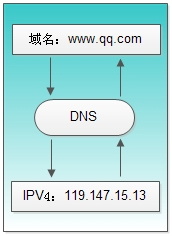

# 前端知识点总结

内容持续更新中...

# 目录

## 1. JavaScript基础
   1. [DOM（文档对象模型）](http://caibaojian.com/javascript-lessons/2.2-DOM/?q=)
   2. [JavaScript 基本数据类型和引用数据类型](https://segmentfault.com/a/1190000006752076)
   3. [JS数据类型判断](https://zhuanlan.zhihu.com/p/129642585)
   4. [事件冒泡和事件捕获](https://zh.javascript.info/bubbling-and-capturing)
   5. [js中的事件委托或事件代理详解](https://juejin.im/post/6844903589052153869)
   6.  [DOM 事件模型](https://juejin.im/post/6844903850323755021)
   7.  [JS函数防抖和函数节流](https://juejin.im/post/6844903535125987335)
   8.  [JavaScript 设计模式](https://juejin.im/post/6844904032826294286#heading-61)
   9.  [跨域解决方案](https://juejin.im/post/6844903767226351623)
   10. [页面间通信与数据共享](https://juejin.im/post/6844903681595277320)
   11. [JSON 相关知识点](https://www.sojson.com/json/json_what.html)
   12. [数组和对象的区别与联系](https://www.jianshu.com/p/08e2e7da6d2d)
   13. [JS中异常捕获](https://blog.cuiyongjian.com/fe/catch-error/)
   14. [arguments对象详解](https://zhuanlan.zhihu.com/p/23007032)
   15. [ Cookie, LocalStorage 与 SessionStorage](https://jerryzou.com/posts/cookie-and-web-storage/)
  
## 2. JavaScript 进阶
   1. [JavaScript深入之词法作用域和动态作用域](https://github.com/mqyqingfeng/Blog/issues/3)
   2. [JavaScript深入之执行上下文栈 ](https://github.com/mqyqingfeng/Blog/issues/4)
   3. [JavaScript作用域链 ](./JavaScript基础/JavaScript%20作用域和作用域链.md)
   4. [JavaScript闭包](./JavaScript基础/闭包.md)
   5. [JavaScript基础——this](https://github.com/axuebin/articles/issues/6)
   6. [JavaScript基础心法——call apply bind ](https://github.com/axuebin/articles/issues/7)
   7. [JavaScript深入之bind的模拟实现 ](https://github.com/mqyqingfeng/Blog/issues/12)
   8. [JavaScript深入之new的模拟实现](https://github.com/mqyqingfeng/Blog/issues/13)
   9. [Javascript原型链及原型链继承](./JavaScript基础/Javascript原型链及原型链继承.md)
   10. [JavaScript 中的继承：ES3、ES5 和 ES6](https://juejin.im/post/6844903543476846600)
   11. [JavaScript Promise](./JavaScript基础/Promise.md)
   12. [从event loop规范探究javaScript异步及浏览器更新渲染时机](https://github.com/aooy/blog/issues/5)
   13. [JavaScript 深浅拷贝](https://github.com/axuebin/articles/issues/20)
   14. [JavaScript 函数式编程](https://github.com/zhaiyy/blog/blob/master/article/Javascript%20%E5%87%BD%E6%95%B0%E5%BC%8F%E7%BC%96%E7%A8%8B.md)
   15. [PWA - Service Worker](https://github.com/zhaiyy/blog/blob/master/article/%EF%BC%88PWA%EF%BC%89-%20Service%20Worker%20copy.md)
   16. [JavaScript 经典面试题库](./JavaScript基础/JS经典面试布局题库.md)

## 3. html基础
  1. [行内元素和块级元素](https://www.jianshu.com/p/d69878549d92)
  2. [html5新增的属性](https://juejin.im/post/6844903878857588750)
  3. [js在微信、微博、QQ、Safari唤起App的解决方案](https://juejin.im/post/6844903650007973901)
  4. [Viewport 详解](https://my.oschina.net/u/4398200/blog/3336443)
  5. [App的三种开发模式](https://www.jianshu.com/p/e4375cbad16e)
  6. [浏览器的回流与重绘 (Reflow & Repaint)](https://juejin.im/post/6844903569087266823)

## 4. CSS 基础
  1. [CSS 选择器](http://www.ruanyifeng.com/blog/2009/03/css_selectors.html)
  2. [CSS flex 使用](./css基础/css%20flex%20的用法.md)
  3. [CSS 属性 position 定位详解](https://www.ruanyifeng.com/blog/2019/11/css-position.html)
  4. [CSS 属性 display](https://juejin.im/post/6844903781566513160)
  5. [CSS 盒子模型](https://segmentfault.com/a/1190000015235886)
  7. [CSS 浮动 float](https://www.jianshu.com/p/07eb19957991)
  8. [css3 新增的属性](https://juejin.im/entry/6844903486618861575)
  9. [css3 动画](https://www.ruanyifeng.com/blog/2014/02/css_transition_and_animation.html)
  10. [css3 Animate/transition/translate](https://segmentfault.com/a/1190000004460780)
  11. [css3 rem 与 em](https://blog.csdn.net/yunfeng482/article/details/87397279)
  12. [css3 响应式布局](https://juejin.im/post/6844903814332432397)
  13. [CSS 常见布局方式](https://juejin.im/post/6844903491891118087#heading-1)
  14. [css预处理器，Sass、Less和Stylus](https://zhuanlan.zhihu.com/p/23382462)
  15. [移动端1px解决方案](https://juejin.im/post/6844903877947424782)
  16. [CSS 经典面试布局题库](./css基础/CSS%20经典面试布局题库.md)

## 5. [VUE 基础](https://ustbhuangyi.github.io/vue-analysis/v2/data-driven/new-vue.html#%E6%80%BB%E7%BB%93)
  1. [vue双向数据绑定MVVM](https://github.com/DMQ/mvvm)
  2. [vue 生命周期](https://juejin.im/entry/6844903602356502542)
  3. [vue 数据监听](https://www.jianshu.com/p/311bb4541336)
  4. [vue 状态管理 vuex 原理](https://www.jianshu.com/p/3c613021b4f7)
  5. [vue 组件通信](https://juejin.im/post/6844903887162310669)
  6. [ Virtual DOM 虚拟 DOM](https://mp.weixin.qq.com/s/oAlVmZ4Hbt2VhOwFEkNEhw)
  7. [vue computed和watch ](https://juejin.im/post/6844903667884097543)
  8. [vue 高阶函数](https://juejin.im/entry/6844903545607553032)
  9. [vue mixin](https://flyyang.me/2019/01/24/vue-mixin/)
  10. [Vue 模板编译原理](https://github.com/berwin/Blog/issues/18)
  11. [vue3 新特性](https://juejin.im/post/6867123074148335624)
  12. [vue 与 react 对比](https://www.html.cn/qa/react/18726.html)

## 6. 工程化
  ### 6.1 webpack
  1. [webpack 编译流程](https://mp.weixin.qq.com/s?__biz=MzI0MTUxOTE5NQ==&mid=2247484030&idx=1&sn=d630d4b3995bbfd50f99e781074acfeb)
  2. [webpack Loader](https://github.com/axuebin/articles/issues/38)
  3. [如何开发webpack loader](https://github.com/zhaiyy/blog/blob/master/article/webpack%20loader.md)
  4. [webpack plugin](https://champyin.com/2020/01/12/%E6%8F%AD%E7%A7%98webpack-plugin/)
  5. [webpack 打包优化](https://juejin.im/post/6844903700247527438)
  6. [webpack 5 新特性](https://juejin.im/post/6882663278712094727)
  7. [webpack 5 ModuleFederationPlugin vue 项目初体验](https://juejin.im/post/6883408771322740743)
  8. [vite](https://juejin.im/post/6869915676501835783#heading-6)

  ### 6.2 Babel

  1. [一篇文章了解前端开发必须懂的 Babel](https://mp.weixin.qq.com/s/C-WmM5tjfc3r4sB52C4R0Q)
  2. [不容错过的 Babel7 知识](https://juejin.im/post/6844904008679686152)
  3. [前端工程师的自我修养-关于 Babel 那些事儿](https://juejin.im/post/6844904079118827533)

  ### 6.3 模板引擎
----------------------------------
* [npm](#npm)
* [gulp && webpack](#gulp)
* [计算机网络](#计算机网络)
* [算法程序](#算法程序)
* [前端性能优化](#前端性能优化)


## 计算机网络

**索引**

1. [content-type](#content-type)
2. [从URL输入到页面展现发生了什么](#从URL输入到页面展现发生了什么)
3. [网络层次划分](#网络层次划分)
4. [tcp协议属于网络层次哪一层](#tcp协议属于网络层次哪一层)
5. [DNS原理及其解析过程](#DNS原理及其解析过程)
6. [三次握手](#三次握手)
7. [四次分手](#四次分手)
8. [TCP与UDP的区别](#TCP与UDP的区别)
9. [http与https的区别](#http与https的区别)
10. [http状态码有那些？分别代表是什么意思？](#net-10)
----------------------------------

### content-type

Content-Type，内容类型，一般是指网页中存在的Content-Type，用于定义网络文件的类型和网页的编码，决定浏览器将以什么形式、什么编码读取这个文件，这就是经常看到一些Asp网页点击的结果却是下载到的一个文件或一张图片的原因

* text/html
* image/jpeg
* image/gif

### 从URL输入到页面展现发生了什么

1. DNS解析
2. TCP连接
3. 发送HTTP请求
4. 服务器处理请求并返回HTTP报文
5. 浏览器解析渲染页面
6. 连接结束

### 网络层次划分

它将计算机网络体系结构的通信协议划分为七层，自下而上依次为：物理层（Physics Layer）、数据链路层（Data Link Layer）、网络层（Network Layer）、传输层（Transport Layer）、会话层（Session Layer）、表示层（Presentation Layer）、应用层（Application Layer）。其中第四层完成数据传送服务，上面三层面向用户。
　　除了标准的OSI七层模型以外，常见的网络层次划分还有TCP/IP四层协议以及TCP/IP五层协议，它们之间的对应关系如下图所示：


### tcp协议属于网络层次哪一层

可见 TCP/IP 被分为 4 层，每层承担的任务不一样，各层的协议的工作方式也不一样，每层封装上层数据的方式也不一样：

(1)应用层：应用程序通过这一层访问网络，常见 FTP、HTTP、DNS 和 TELNET 协议；

(2)传输层：TCP 协议和 UDP 协议；

(3)网络层：IP 协议，ARP、RARP 协议，ICMP 协议等；

(4)网络接口层：是 TCP/IP 协议的基层，负责数据帧的发送和接收

### DNS原理及其解析过程

* #### 为什么需要DNS解析域名为IP地址？
网络通讯大部分是基于TCP/IP的，而TCP/IP是基于IP地址的，所以计算机在网络上进行通讯时只能识别如“202.96.134.133”之类的IP地址，而不能认识域名。我们无法记住10个以上IP地址的网站，所以我们访问网站时，更多的是在浏览器地址栏中输入域名，就能看到所需要的页面，这是因为有一个叫“DNS服务器”的计算机自动把我们的域名“翻译”成了相应的IP地址，然后调出IP地址所对应的网页。

* #### 具体什么是DNS？
DNS( Domain Name System)是“域名系统”的英文缩写，是一种组织成域层次结构的计算机和网络服务命名系统，它用于TCP/IP网络，它所提供的服务是用来将主机名和域名转换为IP地址的工作。DNS就是这样的一位“翻译官”，它的基本工作原理可用下图来表示。


* #### DNS 的过程？
关于DNS的获取流程：DNS是应用层协议，事实上他是为其他应用层协议工作的，包括不限于HTTP和SMTP以及FTP，用于将用户提供的主机名解析为ip地址。
具体过程如下：
① 用户主机上运行着DNS的客户端，就是我们的PC机或者手机客户端运行着DNS客户端了

② 浏览器将接收到的url中抽取出域名字段，就是访问的主机名，比如http://www.baidu.com/
, 并将这个主机名传送给DNS应用的客户端

③ DNS客户机端向DNS服务器端发送一份查询报文，报文中包含着要访问的主机名字段（中间包括一些列缓存查询以及分布式DNS集群的工作）

④ 该DNS客户机最终会收到一份回答报文，其中包含有该主机名对应的IP地址

⑤ 一旦该浏览器收到来自DNS的IP地址，就可以向该IP地址定位的HTTP服务器发起TCP连接

### 三次握手

第一次握手：建立连接时,客户端发送syn包(syn=j)到服务器,并进入SYN_SEND状态,等待服务器确认；

SYN：同步序列编号(Synchronize Sequence Numbers)

第二次握手：服务器收到syn包,必须确认客户的SYN（ack=j+1）,同时自己也发送一个SYN包（syn=k）,即SYN+ACK包,此时服务器进入SYN_RECV状态；

第三次握手：客户端收到服务器的SYN＋ACK包,向服务器发送确认包ACK(ack=k+1),此包发送完毕,客户端和服务器进入ESTABLISHED状态,完成三次握手.

完成三次握手,客户端与服务器开始传送数据

### 四次分手

由于TCP连接是全双工的，因此每个方向都必须单独进行关闭。这个原则是当一方完成它的数据发送任务后就能发送一个FIN来终止这个方向的连接。收到一个 FIN只意味着这一方向上没有数据流动，一个TCP连接在收到一个FIN后仍能发送数据。首先进行关闭的一方将执行主动关闭，而另一方执行被动关闭。

（1）客户端A发送一个FIN，用来关闭客户A到服务器B的数据传送。

（2）服务器B收到这个FIN，它发回一个ACK，确认序号为收到的序号加1。和SYN一样，一个FIN将占用一个序号。

（3）服务器B关闭与客户端A的连接，发送一个FIN给客户端A。

（4）客户端A发回ACK报文确认，并将确认序号设置为收到序号加1。

### TCP与UDP的区别

UDP和TCP协议的主要区别是两者在如何实现信息的可靠传递方面不同。TCP协议中包含了专门的传递保证机制，当数据接收方收到发送方传来的信息时，会自动向发送方发出确认消息；发送方只有在接收到该确认消息之后才继续传送其它信息，否则将一直等待直到收到确认信息为止。

与TCP不同，UDP协议并不提供数据传送的保证机制。如果在从发送方到接收方的传递过程中出现数据报的丢失，协议本身并不能做出任何检测或提示。因此，通常人们把UDP协议称为不可靠的传输协议。相对于TCP协议，UDP协议的另外一个不同之处在于如何接收突发性的多个数据报。不同于TCP，UDP并不能确保数据的发送和接收顺序。事实上，UDP协议的这种乱序性基本上很少出现，通常只会在网络非常拥挤的情况下才有可能发生。

既然UDP是一种不可靠的网络协议，那么还有什么使用价值或必要呢？其实不然，在有些情况下UDP协议可能会变得非常有用。因为UDP具有TCP所望尘莫及的速度优势。虽然TCP协议中植入了各种安全保障功能，但是在实际执行的过程中会占用大量的系统开销，无疑使速度受到严重的影响。反观UDP由于排除了信息可靠传递机制，将安全和排序等功能移交给上层应用来完成，极大降低了执行时间，使速度得到了保证

### http与https的区别

通常, HTTP直接和TCP通信, 当使用SSL时, 演变成了先和SSL通信, 再由SSL和TCP通信了, 简而言之, 所谓HTTPS, 其实就是身披SSL协议的这层外壳的HTTP.

在采用SSL后, HTTP就拥有了HTTPS的加密, 证书和完整性的保护这些功能.
* HTTP 的 URL 以 HTTP:// 开头，而 HTTPS 的 URL 以 HTTPs:// 开头；
* HTTP 是不安全的，而 HTTPS 是安全的，比如一些银行、政府、平台网站会使用 HTTPS，就拿小编现在所在的SUBMAIL赛邮云通信来说， 我们的官网 API 就采取了 HTTPS 协议，提高其安全性。
* 传输效率上 HTTP 要高于 HTTPS ，因为 HTTPS 需要经过加密过程，过程相比于 HTTP 要繁琐一点，效率上低一些也很正常；
* HTTP 无需证书，而 HTTPS 必需要认证证书；
* 从 SEO 方面来参考，发现百度和谷歌是不同的。谷歌在 HTTPS 站点的收录问题上与对 HTTP 站点态度并无什么不同之处，甚至把“是否使用安全加密”（HTTPS）作为搜索排名算法中的一个参考因素，采用 HTTPS 加密技术的网站能得到更多的展示机会。百度曾表示不主动抓取 HTTPS 网页，所以目前采取 HTTPS 的网站是很难被百度收录的，不过有消息称百度接下来可能会向谷歌靠拢，对于 HTTPS 页面同样主动抓取。
* 还有一点也不能忽视，使用 HTTPS 需要证书，申请证书是要费用的，相比于 HTTP 不需要证书来说，HTTPS 这笔费用是无法避免的。

### <h3 id='net-10'>http状态码有那些？分别代表是什么意思？</h3>

简单版

* 100 Continue 继续， 一般在发送post请求时， 已发送了http header之后服务端将返回此信息， 表示确认， 之后发送具体参数信息
* 200 OK 正常返回信息
* 201 Created 请求成功并且服务器创建了新的资源
* 202 Accepted 服务器已接受请求， 但尚未处理
* 301 Moved Permanently 请求的网页已永久移动到新位置。
* 302 Found 临时性重定向。
* 303 See Other 临时性重定向， 且总是使用 GET 请求新的 URI。
* 304 Not Modified 自从上次请求后， 请求的网页未修改过。

* 400 Bad Request 服务器无法理解请求的格式， 客户端不应当尝试再次使用相同的内容发起请求。
* 401 Unauthorized 请求未授权。
* 403 Forbidden 禁止访问。
* 404 Not Found 找不到如何与 URI 相匹配的资源。

* 500 Internal Server Error 最常见的服务器端错误。
* 503 Service Unavailable 服务器端暂时无法处理请求（ 可能是过载或维护）。

## 算法程序

**索引**

1. [用javascript 语言,手工实现 repeat 函数](#code-1)
2. [使用原生javacript实现事件代理](#使用原生javacript实现事件代理)
3. [快速排序](#快速排序)
4. [数组去重](#数组去重)
5. [将url的查询参数解析成字典对象](#将url的查询参数解析成字典对象)
6. [使用js实现bind,trigger](#code-6)
7. [判断一个字符串是不是数字字符串](#判断一个字符串是不是数字字符串)
8. [一个有序数组，输出指定值（可能重复）的下标](#code-8)
9. [冒泡排序](#冒泡排序)
10. [插入排序](#插入排序)
11. [去首位空格](#去首位空格)
12. [求和函数](#求和函数)
13. [两个有序数组合成一个有序数组](#两个有序数组合成一个有序数组)
14. [实现 DOM 操作 insertAfter](#code-14)
15. [写出一个数组展开函数](#code-15)
16. [实现jsonp封装函数](#code-16)
----------------------------------

### <h3 id='code-1'>用javascript 语言,手工实现 repeat 函数</h3>
 两个参数:
   1. 要重复的原始字符串
   2. 需要重复的次数
   例如:
   repeat ('a', 3) => 'aaa'

```
function repeat(str, count) {
  var s = '';
  for (let i = 0; i < count; i++) {
    s += str;
  }
  return s
};
repeat('a', 3);

//用递归实现

function repeat(str, count) {

  return rep(str, '', count);

  function rep(oldstr, str, count) {

    if (count == 0) {

      return str;

    } else {

      str += oldstr;

      return rep(oldstr, str, count - 1)

    }

  }

}

// 更新算法
 function repeat(str,num,oldstr = ''){
        oldstr = oldstr + str
        return num<=1 ? oldstr : repeat(str,num-1 ,oldstr)
    }
```

 ### 使用原生javacript实现事件代理

 例子:

 delegate ( containerElement, 'click', 'remove-item', onClick )

 会绑定一个事件代理到 containerElement 这个元素, 即是说, 所有在 containerElement 这个容器下的所有

 remove-item 在click事件出现时都会触发 onClick 这个回调

```
function delegate(parentElem, eventType, className, callback) {

  if (parentElem.addEventListener) {

    parentElem.addEventListener(eventType, function(event) {

      if (event.target.classList.contains(className)) {

        callback(event);

      }

    })

  } else if (parentElem.attachEvent) {

    parentElem.attachEvent('on' + eventType, function(event) {

      if (event.srcElement.classList.contains(className)) {

        callback(event)

      }

    })

  }

}

```

### 快速排序
思想很简单，整个排序过程只需要三步：

（1）在数据集之中，选择一个元素作为"基准"（pivot）。

（2）所有小于"基准"的元素，都移到"基准"的左边；所有大于"基准"的元素，都移到"基准"的右边。

（3）对"基准"左边和右边的两个子集，不断重复第一步和第二步，直到所有子集只剩下一个元素为止。

```
quicksort([1,21,1,2,34,2,521,21,335,22,457,23])

function quicksort(ary) {

  if (ary.length <= 1) {

    return ary;

  }

  var pivotIndex = Math.floor(ary.length / 2);

  var pivot = ary[pivotIndex];

  var greaterAry = [],
    lessAry = [];

  var pivotAry = [];

  ary.forEach(function(element, index) {

    if (element > pivot) {

      greaterAry.push(element);

    } else if (element < pivot) {

      lessAry.push(element);

    } else if (element == pivot) {

      pivotAry.push(element)

    }

  });

  return quicksort(lessAry).concat(pivotAry, quicksort(greaterAry));

}
```

### 数组去重

#### 纯数字数组去重（方法一）

```

unique([1,21,1,2,34,2,521,21,335,22,457,23]);

function unique(ary) {

  if (ary == undefined || ary.length == 0) return;

  var obj = {};

  for (var i = 0; i < ary.length; i++) {

    var element = ary[i];

    if (obj[element] != element) {

      obj[element] = element;

    } else if (obj[element] == element) {

      ary.splice(index, 1);

      i--;

    }

  }

  return ary;

}
```

#### 纯数字数组去重（方法二 ES6）

```
unique([1, 21, 1, 2, 34, 2, 521, 21, 335, 22, 457, 23]);

function unique(ary) {
  if (ary.length == 0 || ary.length == 1) return ary;
  return Array.from(new Set(ary));
}

```
#### 对象数组去重（方法一）

```
uniqueAry([1, 4, 2, 3, {a: 1}, 63, 5, 6, {a: 1}]);

function uniqueAry(ary) {
  if (ary.length == 0 || ary.length == 1) return ary;
  var obj = {};
  for (var i = 0; i < ary.length; i++) {
    var ele = ary[i];
    //如果当前元素类型为引用数据类型，转换成json字符串
    if (typeof(ele) == 'object') ele = JSON.stringify(ele);
    if (obj[ele] == ele) {
      ary.splice(i, 1);
      i--;
    } else if (obj[ele] != ele) {
      obj[ele] = ele;
    }
  }
  return ary;
};
```


### 将url的查询参数解析成字典对象

```
function getQueryObject(url) {
  url = url == null ? window.location.href : url;
  var search = url.substring(url.lastIndexOf("?") + 1);
  var obj = {};
  var reg = /([^?&=]+)=([^?&=]\*)/g;
  search.replace(reg, function(rs, $1, $2) {

    var name = decodeURIComponent($1);

    var val = decodeURIComponent($2);

    var = String(val);

    obj[name] = val;

    return rs;

  });

  return obj;

}
```


### <h3 id='code-6'>使用js实现bind,trigger</h3>

```

function Emitter() {

  this._listener = {}; //_listener[自定义的事件名] = [所用执行的匿名函数1, 所用执行的匿名函数2]

}

//注册事件

Emitter.prototype.bind = function(eventName, funCallback) {

  var listenersArr = this._listener[eventName] || []; ////this._listener[eventName]没有值则将listener定义为[](数组)。

  listenersArr.push(funCallback);

  this._listener[eventName] = listenersArr;

}

//触发事件

Emitter.prototype.trigger = function(eventName) {

  //未绑定事件

  if (!this._listener.hasOwnProperty(eventName)) {

    console.log('you do not bind this event');

    return;

  }

  var args = Array.prototype.slice.call(arguments, 1); ////args为获得除了eventName后面的参数(最后被用作注册事件的参数)

  var listenersArr = this._listener[eventName];

  var _this = this;

  if (!Array.isArray(listenersArr)) return; ////自定义事件名不存在

  listenersArr.forEach(function(callback) {

    try {

      callback.call(_this, args);

    } catch (e) {

      console.log(e);

    }

  });

}

//解绑

Emitter.prototype.unbind = function(eventName, callback) {

  this._listener.hasOwnProperty(eventName) && delete this._listener[eventName];

  callback && callback();

}
```

### 判断一个字符串是不是数字字符串
```

numberString('32324');

function numberString(num) {

  if (num == undefined || typeof(num) != 'string') return;

  return !isNaN(num);

}

```

### <h3 id='code-8'>一个有序数组，输出指定值（可能重复）的下标</h3>

```

indexAry(3,[1,2,3,4,5,6,7,8]);

function indexAry(ele, ary) {

  if (ary == undefined || ary.length == 0 || ele == undefined || isNaN(ele)) return -1;

  let indexAry = [];

  ary.forEach(function(element, index) {

    if (element == ele) {

      indexAry.push(index);

    } else if (element > ele) {

      return;

    };

  });

  return indexAry.length ? indexAry.toString() : -1;
}
//利用二分查找法查找
function bsearch(target, ary, start = 0, end = ary.length - 1) {
        if (target < ary[start] || target > ary[end] || start >= end) {
            return []
        }
        let mid = start + Math.floor((end - start) / 2)
        let indexList = []
        if (ary[mid] == target) {
            indexList.push(mid)
            if (ary[mid + 1] == target) {
                var i = 1
                while (ary[mid + i] == target) {
                    indexList.push(mid + i)
                    i++
                }
            }
            if (ary[mid - 1] == target) {
                var i = 1
                while (ary[mid - i] == target) {
                    indexList.push(mid - i)
                    i ++
                }
            }            return indexList
        } else if (ary[mid] > target) {
            return indexList.concat(bsearch(target, ary, start, mid - 1))
        } else if (ary[mid] < target) {
            return indexList.concat(bsearch(target, ary, mid + 1, end))
        }

    }
```

### 冒泡排序
```
    function bubbleSort(numSeries) {
      if (numSeries.length < 2) {
        return numSeries;
      }
      let len = numSeries.length;

      for (let i = 0; i < len - 1; i++) {
        for (let j = i; j < len - i - 1; j++) {
          if (numSeries[j] > numSeries[j + 1]) {
            [
              numSeries[j],
              numSeries[j + 1]
            ] = [
              numSeries[j + 1],
              numSeries[j]
            ];
          }
        }
      }

      return numSeries;
    }
```

### 插入排序

```
    function insertSort(arr) {
      var len = arr.length,
        temp;

      for (var i = 1; i < len; i++) {
        var j;
        temp = arr[i];
        j = i;

        while (j > 0 && arr[j - 1] > temp) {
          arr[j] = arr[j - 1];
          j--;
        }
        arr[j] = temp;
      }
      return arr;
    }

```

### 去除首尾空格
```
    function removePlace(str) {
      var reg = /(^s\*)|(s\*)$/;
      if (str && typeof str === 'string') {
        return str.replace(reg, '');
      }
    }

```

### 求和函数
   sum(2,3)(5),正确返回true，错误返回false

```
  function sum(a, b) {
    return function(total) {
      return a + b == total;
    }
  }
```

### 两个有序数组合成一个有序数组
归并排序，思路：
1. 两个有序数组进行首项比较，把首项小的放入排序数组，当前数组删除此项
2. 一次进行首项比较，直到又一个数组长度为0
3. 长度不为0的数组元素，肯定是整个要排序数组中最大的元素
4. 直接进行数组拼接

```
function mergeSort(left, right) {
  var lh = left.length,
    rh = right.length;
  var soryAry = [];
  if (lh == 0 || rh == 0) return left.concat(right);
  while (left.length != 0 && right.length != 0) {
    if (left[0] > right[0]) {
      soryAry.push(right.shift(0));
    } else if (left[0] < right[0]) {
      soryAry.push(left.shift(0));
    } else if (left[0] == right[0]) {
      soryAry.push(left.shift(0));
      soryAry.push(right.shift(0));
    }
  }
  return soryAry.concat(left.concat(right));;
}

```
### <h3 id='code-14'>实现 DOM 操作 insertAfter </h3>
首先了解一下 insertBefore
`node.insertBefore(newnode,existingnode)`
* Node 对象。  您插入的节点。
* newnode Node 对象 必需。需要插入的节点对象。
* existingnode  Node object 可选。在其之前插入新节点的子节点。如果未规定，则 insertBefore 方法会在结尾插入 newnode。

所以我们要实现
`insertAfter(newnode,existingnode)`
```
function insertAfter(newnode, existingnode) {
  var parentNode = existingnode.parentNode;
  if (existingnode == parentNode.lastChild) {
    return parentNode.insertBefore(newnode, null)
  }
  return parentNode.insertBefore(newnode, existingnode.nextSibling)
};
```

### <h3 id='code-15'>写出一个数组展开函数，如输入[1,[2,[3,4,5],2],3]，输出[1, 2, 3, 4, 5, 2, 3] </h3>

```
 function openAry(ary) {
        var list =[]
        for(let i in ary){
            if(ary[i] instanceof  Array){
                list = list.concat(openAry(ary[i]))
            }else{
              list.push(ary[i])
            }
        }
        return list
    }
```
### <h3 id='code-16'> 实现jsonp封装函数，调用方式如下</h3>

```
jsonp('http://www.baidu.com',{
    param1:1,
    param2:2
},function(data){
    console.log(data)
})

```

```
function jsonp(url,param,callback){
    let postUrl = url + '?' + objToString(param) +'callback = '+callback
    let jsonp = document.createElement('script');
    jsonp.type = 'text/javascript';
    jsonp.src = postUrl;
    document.getElementsByTagName('head')[0].appendChild(jsonp);
}
function objToString(obj) {
    let str = ''
    for(let key in obj) {
        str += key + '=' + obj[key] +'&'
    }
    return str
}


```
## 前端性能优化

  1、代码优化：
  1）标签语义化，

  2）避免冗余代码避免垃圾代码（把常用的单独写，统一用的时候调用，不要写重复的）

  降低代码的耦合度

  3）尽量少使用同步请求

  4）避免js内存泄露

  5）少使用闭包

  6）少使用dom动态操作方法

  7）文档碎片

  8）移动端，用css3动画，替换js动画

  2、数据优化

  1）数据缓存

  2）数据异步加载（页面加载先加载第一屏，其他的在慢慢架子啊）

  3）图片延迟加载

  3、请求资源的优化

  1）css或js合并成一个，减少网络资源请求数

  2）图片csssprite技术，图片的合并压缩，通过background-position定位查找

  只加载一次大图

  3)如果页面中有影音文件，没有特殊需求，都等页面渲染完毕之后稍后加载

  4、请求资源大小的控制（尤其是移动端）

  1）不要乱用框架，小页面能不用就不用，移动端大项目，不建议使用jQuery系类的，使用zepto

  替换jQuery，使用amazeUI代替jQueryMobile

  2）与设计师商量，移动端少用图片，需要用的话，能用代码写不要图片

  3）图片base64技术解决

  5、服务器端的优化

  1）服务器做一下gzip压缩，后台做一下优化

  2)做一下服务器分布集群

  3)cdn

  静态资源图片：

  在布局的时候就能定下来的图片

  对于小图片，小图标用cssscript优化

  对于大图可以切成小图，依次加载

  动态资源图片：通过ajax返回的图片

  图片base64技术，以上的效果都不好用

  图片延迟加载，

  1、先给当前要显示图片的区域，一张比较小的背景图或背景颜色，占个位置/2、

  2、用varimg=newImage()创建一张临时的图片，加载我们真实得地址，然后把这个

  把这个元素添加到规定的区域


