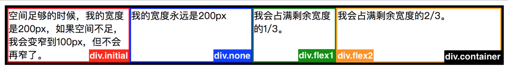

# css flex 的用法

flex属性指定项目的长度，相对于同一容器内的其余项目。
Flex 是 Flexible Box 的缩写，意为"弹性布局"，用来为盒状模型提供最大的灵活性。

任何一个容器都可以指定为 Flex 布局。

 ```
 .box{
   display: flex;
 }
 ```

** 设为 Flex 布局以后，子元素的`float`、`clear`和`vertical-align`属性将失效。 **

例：
```
.container {
  display: flex;
  display: -webkit - flex;
  border: 4 px solid\ #000;
}

.initial {
 flex: inherit;
 -webkit-flex: inherit;
 width: 200px;
 min-width: 100px;
 border: 2px solid red;
}

.none {
 flex: none;
 width: 200px;
 border: 2px solid blue;

}
.flex1 {
  flex: 1;
  border: 2 px solid green;
}
.flex2 {
  flex: 2;
  border: 2 px solid orange;
}
```


## 参考文章
* [30 分钟学会 Flex 布局
](https://zhuanlan.zhihu.com/p/25303493)

## [>> 查看更多](../README.md)